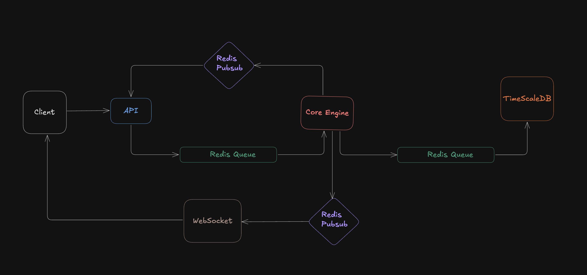
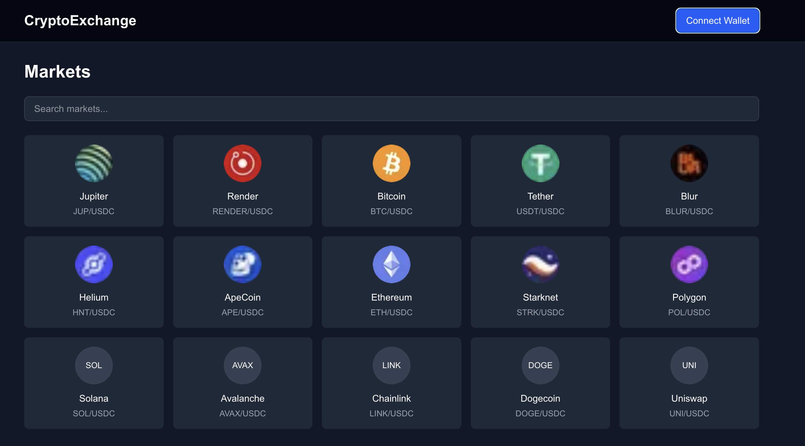
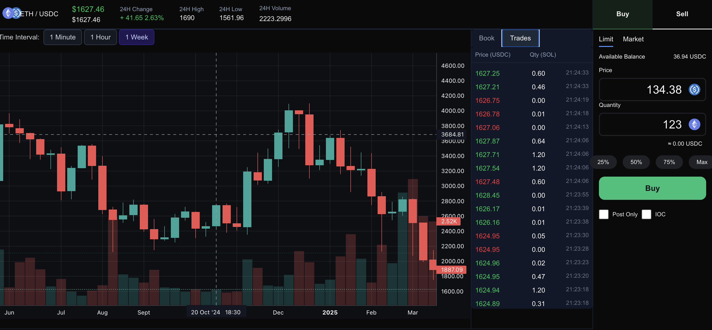
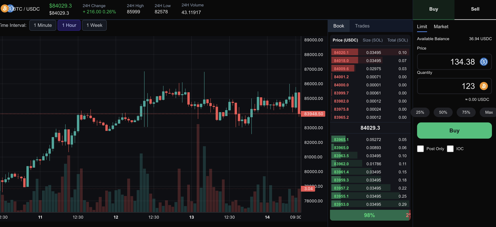

# 📈 Temporal Database: Stock Exchange Web Application using TimescaleDB

A real-time stock trading and analysis platform built using modern technologies like TimescaleDB, Redis, WebSockets, and React. Inspired by professional platforms such as Binance, the application enables efficient trading, live order book management, and real-time charting with low-latency performance.

> Developed by Group SQLite  
> 👤 Diganta Mandal [22CS30062]  
> 👤 Tuhin Mondal [22CS10087]  
> 👤 Antik Sur [22CS10085]

---

## 🚀 Features

- **📊 Real-Time Order Book:** Displays live bid/ask levels with prices, volumes, and types.
- **📈 Candlestick & Volume Charts:** Aggregated and rendered using TimescaleDB and TradingView charts.
- **💰 Buy/Sell Interface:** Market, limit, and stop order placement with live status tracking.
- **📡 WebSockets for Live Updates:** Real-time trades, price updates, and order book changes.
- **📉 Dashboard:** Advanced UI with dynamic charts, trade feeds, and order management tools.

---

## 🏗️ System Architecture

### 🔧 Backend Modules

- REST API (Node + Express)
- Order Matching Engine
- Redis Queues and Pub/Sub
- WebSockets Server
- TimescaleDB for persistent storage

### ⚙️ Backend Architecture

The system follows a two-tiered architecture inspired by memory hierarchies — combining Redis for fast, in-memory processing and TimescaleDB for durable, historical storage.

---

## 🖼️ UI Screenshots

### 🏠 Home Page

### 📉 Trades + Candlestick Chart + Volume

### 📘 Order Book View

---

## 🛠️ Tech Stack

### ⚙ Backend

- **Node.js + Express** – API server
- **Redis** – In-memory store for pub/sub & queues
- **TimescaleDB** – Time-series DB built on PostgreSQL
- **WebSockets** – Live updates to clients
- **Docker** – Containerized deployment

### 🎨 Frontend

- **Next.js + React** – Dynamic SSR and component rendering
- **Tailwind CSS** – Utility-first styling
- **shadcn/UI** – Beautiful UI components
- **lightweight-charts** – Financial chart rendering

---

## 🧪 TimescaleDB Features in Use

- Hypertables for time-partitioned stock data
- Continuous Aggregation for candlesticks (1m/1h/1w)
- Fast, scalable time-windowed queries
- Historical data compression & analysis

---

## 📡 WebSocket Use-Cases

- Live price updates
- Instant order book sync
- Streaming recent trades
- Real-time candlestick/volume chart updates

---

## 📌 Future Scope

- ✅ Portfolio management module
- 📢 Real-time alerts (push/email/SMS)
- 🤖 ML-based anomaly detection and trend prediction
- 🧩 Distributed matching engine for large-scale deployment

---

## 📚 References

- [TimescaleDB Docs](https://docs.timescale.com/)
- [Redis Pub/Sub](https://redis.io/docs/latest/develop/interact/pubsub/)
- [Binance API](https://www.binance.com/en-IN/binance-api)
- [WebSocket API](https://developer.mozilla.org/en-US/docs/Web/API/WebSocket)
- [lightweight-charts](https://www.tradingview.com/chart/)
- [Next.js Docs](https://nextjs.org/docs)
- [Docker Compose Docs](https://docs.docker.com/compose/install/)

---

## 📄 License

This project is for educational and demonstration purposes. Contact the authors for reuse or extension.
